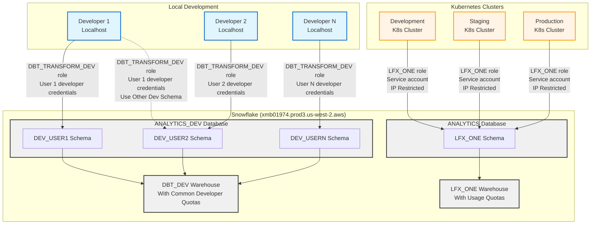

# Datalake Integration

## Overview

The LFX One application integrates with Snowflake to provide data analytics and
reporting capabilities. The integration uses DBT (Data Build Tool) to
manage data transformations and supports multiple environments: local
development for individual developers, and shared development, staging, and
production Kubernetes clusters. This multi-environment approach enables
developers to test changes in isolation while maintaining consistency across
deployed environments.

## Snowflake Connectivity

### Local Development

For local testing and development, engineers connect to Snowflake using their
individual Snowflake developer accounts. This provides isolated development
schemas where developers can test changes without affecting shared environments.
Each developer has their own dedicated schema within the `ANALYTICS_DEV`
database, ensuring complete isolation of development work.

Local development uses the following configuration:

- **Snowflake Account**: `XPB85243`, `JNMHVWD-XPB85243` or `xmb01974.prod3.us-west-2.aws` (legacy)
- **Warehouse**: `DBT_DEV`
- **Role**: `DBT_TRANSFORM_DEV`
- **Database**: `ANALYTICS_DEV`
- **Schema**: `DEV_{{YOUR_DEV_USER}}` (unique per developer, such as: `DEV_DDEAL`)
- **User**: `DEV_{{YOUR_DEV_USER}}`
- **Authentication**: Private key authentication with optional passphrase

Using this approach, developers create their own data models within their "sandbox"
that contain their `DEV_{{YOUR_DEV_USER}}` schema prefix under the `ANALYTICS_DEV`
database.

Examples are:

```text
ANALYTICS_DEV
 |
 - DEV_DDEAL_BRONZE_FIVETRAN_SALESFORCE
   |
   - PROJECTS
   ...
 - DEV_DDEAL_BRONZE_FIVETRAN_SALESFORCE_B2B
 - DEV_DDEAL_BRONZE_RAW
 - DEV_DDEAL_GOLD_FACT
   |
   - CERTIFICATES
   - CODE_CONTRIBUTIONS
   ...
- DEV_DDEAL_PLATINUM_LFX_ONE
   |
   - ACTIVE_WEEKS_STREAK
   - USER_CODE_COMMITS
   - USER_PULL_REQUESTS
```

The LFX App requires the following environment variables:

```bash
SNOWFLAKE_ACCOUNT='JNMHVWD-XPB85243'
SNOWFLAKE_WAREHOUSE='DBT_DEV'
SNOWFLAKE_DATABASE='ANALYTICS_DEV'
SNOWFLAKE_ROLE='DBT_TRANSFORM_DEV'
SNOWFLAKE_USER='DEV_{{YOUR_DEV_USER}}'
SNOWFLAKE_PRIVATE_KEY_PATH='{{path to your private key}}' # example: ${HOME}/.ssh/rsa_key_snowflake.p8
SNOWFLAKE_PASSWORD='{{private key password}}' # when using a private key, this will be the key password
```

For more information, see [the complete list of Snowflake environment variables](https://docs.snowflake.com/en/developer-guide/snowflake-cli/connecting/configure-connections#use-environment-variables-for-snowflake-credentials).

Additional LFX One developer documentation is also available [in the LFX One UX repository](https://github.com/linuxfoundation/lfx-v2-ui/blob/main/docs/architecture/backend/snowflake-integration.md#environment-variables).

Users may choose to leverage other developer models instead of building their
own. In this case, developers should have access to read any models within the
`ANALYTICS_DEV` database when using the `DBT_TRANSFORM_DEV` role.

### Development, Staging, and Production Environments

The development, staging, and production Kubernetes clusters connect to
Snowflake using a shared service account with identical configuration across all
three environments. This ensures consistency and simplifies deployment
management. All three environments connect to the same Snowflake account but use
the dedicated `LFX_ONE` service account for authentication and access control.

These environments use the following configuration:

- **Snowflake Account**: `XPB85243`, `JNMHVWD-XPB85243` or `xmb01974.prod3.us-west-2.aws` (legacy)
- **Service Account**: `LFX_ONE`
- **Warehouse**: `LFX_ONE`
- **Role**: `LFX_ONE`
- **Database**: `ANALYTICS`
- **Schema**: `LFX_ONE`
- **Authentication**: LFX_ONE service account private keys

The service account credentials are securely managed within each Kubernetes
cluster and automatically provided to the application pods at runtime.

## Architecture Diagram


