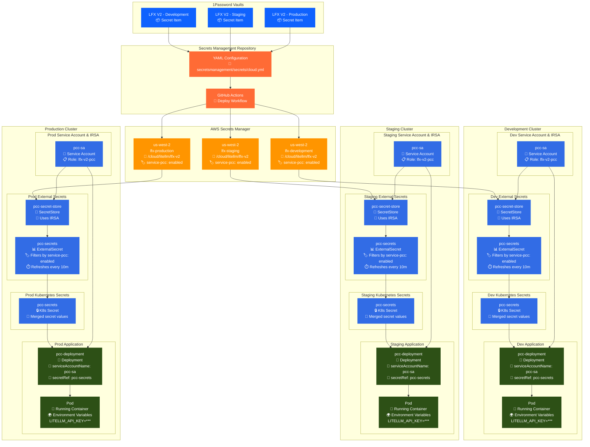

# LFX V2 Secrets Management

This document provides comprehensive guidance for managing secrets in the LFX V2 platform using the centralized
[lfx-secrets-management](https://github.com/linuxfoundation/lfx-secrets-management) repository.

## Table of Contents

- [Overview](#overview)
  - [Integration with Service Accounts](#integration-with-service-accounts)
  - [Secrets Flow Architecture](#secrets-flow-architecture)
- [Prerequisites](#prerequisites)
- [Configuration Requirements](#configuration-requirements)
  - [Tags](#tags)
  - [Service Tag Integration](#service-tag-integration)
  - [Vault Requirements](#vault-requirements)
  - [AWS Destination Accounts](#aws-destination-accounts)
  - [Region](#region)
  - [Path Format](#path-format)
- [Step-by-Step Process](#step-by-step-process)
  - [1. Register the IAM Service Account Role](#1-register-the-iam-service-account-role)
  - [2. Add the ServiceAccount Template](#2-add-the-serviceaccount-template)
  - [3. Create the External Secret Object and Secret Store Custom Resources](#3-create-the-external-secret-object-and-secret-store-custom-resources)
  - [4. Add Secret to 1Password](#4-add-secret-to-1password)
  - [5. Create YAML Configuration](#5-create-yaml-configuration)
  - [6. Submit Pull Request](#6-submit-pull-request)
  - [7. Deploy Secrets](#7-deploy-secrets)
  - [8. Use the Secret in Kubernetes](#8-use-the-secret-in-kubernetes)
- [Configuration Example](#configuration-example)
  - [Configuration Breakdown](#configuration-breakdown)
- [Deploying Secrets](#deployment)
  - [Using GitHub Actions](#using-github-actions)
- [Validation and Testing](#validation-and-testing)
  - [Verify Deployment](#verify-deployment)
  - [Test Service Access](#test-service-access)
- [Best Practices](#best-practices)
  - [Security Considerations](#security-considerations)
  - [Naming Conventions](#naming-conventions)
  - [Environment Management](#environment-management)
  - [Change Management](#change-management)
- [Troubleshooting](#troubleshooting)
  - [Common Issues](#common-issues)
  - [Getting Help](#getting-help)

## Overview

LFX V2 uses an automated secrets management system that synchronizes secrets between 1Password vaults and
AWS Secrets Manager across different environments. This approach ensures:

- **Centralized Management**: All secrets are managed through a single repository
- **Environment Isolation**: Separate vaults and AWS accounts for dev, staging, and production
- **Automated Deployment**: Secrets are deployed using GitHub Actions
- **Security**: Secrets never leave secure storage systems during transit

### Integration with Service Accounts

LFX V2 services automatically consume secrets through a tag-based system managed by the platform's
infrastructure. Each service has a dedicated IAM role and Kubernetes service account that can only access
secrets tagged with their specific service identifier. For detailed information about how services consume
these secrets, see the [Service Account Management documentation](https://github.com/linuxfoundation/lfx-v2-opentofu/blob/main/docs/service-accounts.md).

**Key Integration Points:**

- **Tag-Based Access**: Services only access secrets tagged with their service name
- **External Secrets Operator**: Automatically discovers and merges secrets into Kubernetes
- **IRSA Authentication**: Secure role assumption without storing credentials
- **Event-Based Refresh**: An AWS Lambda listens for tagged secret updates/creations for automatic
  refreshing of External Secrets Operator

### Secrets Flow Architecture

The following diagram illustrates how secrets flow from 1Password through to application deployment:



**Flow Explanation:**

1. **Source**: Secrets are stored in environment-specific 1Password vaults
2. **Configuration**: YAML files define the secret mapping and deployment rules
3. **Deployment**: GitHub Actions deploy secrets to AWS Secrets Manager with appropriate tags
4. **Discovery**: External Secrets Operator uses IRSA to authenticate and discover tagged secrets
5. **Synchronization**: Secrets are merged into Kubernetes secrets and refreshed upon event via Lambda
6. **Consumption**: Applications reference the service account and secret to access environment variables

## Prerequisites

Before managing secrets for LFX V2, ensure you have:

- Access to the appropriate 1Password vaults (see [Vault Requirements](#vault-requirements))
- AWS access to the target environments
- Contributor access to the [lfx-secrets-management](https://github.com/linuxfoundation/lfx-secrets-management) repository
- Understanding of the service architecture and which backend services will consume the secrets

## Configuration Requirements

### Tags

There are two `tags` fields with different purposes. The first tag field configures the deployment
of the secret. Every secret configuration **must** include these tags:

- `lfx_v2` - Identifies the secret as belonging to LFX V2
- `<upstream_service>` - The third-party service providing the secret (e.g., `litellm`, `stripe`, `zoom`)
- `<backend_service>` - The LFX V2 service that will consume the secret (e.g., `pcc`)

**Example tags:**

```yaml
tags: [lfx_v2, litellm, pcc]
```

#### Service Tag Integration

AWS also leverages tags, and determines which Kubernetes service accounts can access the
secret. When secrets are deployed to AWS Secrets Manager, they receive a `service-<name>` resource tag
(e.g., `service-pcc: enabled`). The LFX V2 infrastructure then uses this tag to:

1. **Control Access**: Only the matching service's IAM role can retrieve the secret. For example, the
   `lfx-v2-pcc` service account uses role `arn:aws:iam::788942260905:role/lfx-v2-pcc` in dev to only
   access secrets tagged `"aws:ResourceTag/service-pcc": "enabled"`
2. **Auto-Discovery**: The External Secrets Operator automatically finds and merges all secrets with the
   service tag into a single Kubernetes Secret. Then, the appropriate Secret Store is annotated for sync.
   New secrets will be in the Secret Store after sync within minutes.
3. **Environment Variables**: All tagged secrets are made available as environment variables in the
   service's pods

> **Tag format:** Use `service-<name>: enabled` (e.g., `service-pcc: enabled`) rather than the legacy
> `service: pcc` format. The `service-<name>` convention allows a single secret to be tagged for multiple
> consuming services simultaneously.

For the complete technical details of this integration, refer to the
[Service Account Management documentation](https://github.com/linuxfoundation/lfx-v2-opentofu/blob/main/docs/service-accounts.md).

### Vault Requirements

Secrets that are sourced from 1Password must first be stored in the appropriate vault:

| Environment | 1Password Vault |
| ----------- | --------------- |
| Development | `LFX V2 - Development` |
| Staging | `LFX V2 - Staging` |
| Production | `LFX V2 - Production` |

The name of the secret item should be the same in all vaults it is configured for and match the
`source.onepassword.item` field in the configuration.

### 1Password Item Field Names

The `fields` configuration when using 1Password as a source determines the name of the secret value
within the Kubernetes Secret Store. By default, 1Password items include generic names, such as `credential`
or `password`. **Please create a custom field name to store the secret with a more specific secret name.**

Secrets also need to be placed in JSON format into AWS, or the Kubernetes secret store will fail. When placing
multiple fields into a single secret, this is automatically handled by the list format you have defined them with:

```yaml
source:
  onepassword:
    vaults:
      development: LFX V2 - Development
      staging: LFX V2 - Staging
      production: LFX V2 - Production
    item: LiteLLM LFX Changelog Key
    fields:
      - litellm-key-id
      - litellm-api-key
```

When placing a single field, define the field as a list, or use the `store_as_json: true` configuration:

```yaml
source:
  onepassword:
    vaults:
      development: LFX V2 - Development
      staging: LFX V2 - Staging
      production: LFX V2 - Production
    item: LiteLLM LFX Changelog Key
    fields:
      - litellm-api-key
```

```yaml
source:
  onepassword:
    vaults:
      development: LFX V2 - Development
      staging: LFX V2 - Staging
      production: LFX V2 - Production
    item: LiteLLM LFX Changelog Key
    fields: litellm-api-key
    store_as_json: true
```

### AWS Destination Accounts

Secrets are deployed to these AWS accounts by environment:

| Environment | AWS Account |
| ----------- | ----------- |
| Development | `lfx-development` |
| Staging | `lfx-staging` |
| Production | `lfx-production` |

**Note**: LFX V2 secrets do **not** need to be added to `prdct-*` accounts.

### Region

All secrets under the `lfx/` secrets directory are stored in the **us-west-2** region.

### Path Format

Secrets follow this path convention in AWS Secrets Manager:

```text
path: cloud/<3rd_party_service>/<name_or_identifier>
```

They are automatically prefixed with `/cloudops/managed-secrets/` when created.

The name pattern here does not matter as much as the tags do, which determine which secret
store a secret is pulled into.

**Examples:**

- `cloud/LiteLLM/lfx-v2`
- `cloud/zoom/lfx-v2-meeting-service`
- `cloud/supabase/api_key`

## Step-by-Step Process

> **Already set up?** If your service already has an IAM role, ServiceAccount, SecretStore, and
> ExternalSecret configured, **skip to [Step 4](#4-add-secret-to-1password)** to add a new secret.

The steps below are split into two phases:

- **First-time setup (Steps 1–3):** One-time infrastructure wiring for a new service across three
  repositories. Do this once per service.
- **Adding a secret (Steps 4–8):** Repeat these steps each time you need to add a new secret to
  the service.

### 1. Register the IAM Service Account Role

Each LFX V2 service needs a dedicated IAM role so Kubernetes can authenticate to AWS on its
behalf via IRSA (IAM Roles for Service Accounts). This role also grants the External Secrets
Operator permission to read secrets tagged with the service identifier.

In the [lfx-v2-opentofu](https://github.com/linuxfoundation/lfx-v2-opentofu) repository, add an
entry to `iam-service-accounts-definitions.yaml`:

```yaml
service_account_roles:
  lfx-v2-myresource-service:
```

By default, the namespace, service account name, and service tag are the same as the top level
entry of the service account role. In the case above, when this PR is merged and applied by CI,
OpenTofu creates per environment:

- An IAM role `lfx-v2-myresource-service` with an OIDC trust policy bound to
  `system:serviceaccount:myresource-service:lfx-v2-myresource-service`
- Tag-scoped `secretsmanager:GetSecretValue` policies granting access to secrets tagged either
  `service-myresource = enabled` or `service = myresource`

The role is created in all three AWS accounts:

| Environment | Account ID | Role ARN |
| ----------- | ---------- | -------- |
| Development | `788942260905` | `arn:aws:iam::788942260905:role/lfx-v2-myresource-service` |
| Staging | `844790888233` | `arn:aws:iam::844790888233:role/lfx-v2-myresource-service` |
| Production | `372256339901` | `arn:aws:iam::372256339901:role/lfx-v2-myresource-service` |

Open a PR against `lfx-v2-opentofu` and have the platform team merge and apply it before
continuing to the chart steps below.

To define different values, place them under the service account role entry:

```yaml
service_account_roles:
  lfx-v2-myresource-service:
    namespace: "myresource-service"
    eso_service_tag: "myresource"   # must match the service name used in Step 5
```

The `eso_service_tag` must match the service name used in `destinations.aws_secretsmanager.tags`
in Step 5.

### 2. Add the ServiceAccount Template

In the service's Helm chart, create
`charts/lfx-v2-myresource-service/templates/serviceaccount.yaml`:

```yaml
# Copyright The Linux Foundation and each contributor to LFX.
# SPDX-License-Identifier: MIT
{{- if .Values.serviceAccount.create }}
---
apiVersion: v1
kind: ServiceAccount
metadata:
  name: {{ .Values.serviceAccount.name | default .Chart.Name }}
  namespace: {{ .Release.Namespace }}
  labels:
    app: {{ .Chart.Name }}
  {{- with .Values.serviceAccount.annotations }}
  annotations:
    {{- toYaml . | nindent 4 }}
  {{- end }}
{{- end }}
```

The `annotations` block is empty by default and is populated per environment in `lfx-v2-argocd`
with the IRSA role ARN (shown below).

#### Register the service account

Add this block to the service's Helm chart values, `charts/lfx-v2-myresource-service/values.yaml`:

```yaml
serviceAccount:
  create: true
  name: "lfx-v2-myresource-service"
  annotations: {}
```

In the [lfx-v2-argocd](https://github.com/linuxfoundation/lfx-v2-argocd) repository, in
**`values/dev/lfx-v2-myresource-service.yaml`** (repeat for staging and prod with the
matching account ID) — set the AWS region and the IRSA role ARN:

```yaml
# Copyright The Linux Foundation and each contributor to LFX.
# SPDX-License-Identifier: MIT
---

serviceAccount:
  annotations:
    eks.amazonaws.com/role-arn: arn:aws:iam::788942260905:role/lfx-v2-myresource-service
  automountServiceAccountToken: true
```

Account IDs and files per environment:

| Environment | Account ID | `values/` path |
| ----------- | ---------- | -------------- |
| Development | `788942260905` | `values/dev/lfx-v2-myresource-service.yaml` |
| Staging | `844790888233` | `values/staging/lfx-v2-myresource-service.yaml` |
| Production | `372256339901` | `values/prod/lfx-v2-myresource-service.yaml` |

### 3. Create the External Secret Object and Secret Store Custom Resources

In the [lfx-v2-argocd](https://github.com/linuxfoundation/lfx-v2-argocd) repository:

Create `lfx-v2-argocd/custom-resources/lfx-v2-myresource-service/ExternalSecret.yaml`:

```yaml
# Copyright The Linux Foundation and each contributor to LFX.
# SPDX-License-Identifier: MIT
---
apiVersion: external-secrets.io/v1
kind: ExternalSecret
metadata:
  name: lfx-v2-myresource-service
  namespace: lfx-v2-myresource-service
spec:
  secretStoreRef:
    kind: SecretStore
    name: lfx-v2-myresource-service
  target:
    creationPolicy: Owner
    name: lfx-v2-myresource-service-secrets
  refreshInterval: 10m
  dataFrom:
    - find:
        conversionStrategy: Default
        decodingStrategy: None
        tags:
          service-lfx-v2-myresource-service: enabled
      rewrite:
        - merge:
            conflictPolicy: Error
            into: ''
            strategy: Extract
```

Create `lfx-v2-argocd/custom-resources/lfx-v2-myresource-service/SecretStore.yaml`:

```yaml
# Copyright The Linux Foundation and each contributor to LFX.
# SPDX-License-Identifier: MIT
---
apiVersion: external-secrets.io/v1
kind: SecretStore
metadata:
  name: lfx-v2-myresource-service
  namespace: lfx-v2-myresource-service
spec:
  provider:
    aws:
      auth:
        jwt:
          serviceAccountRef:
            name: lfx-v2-myresource-service
      region: us-west-2
      service: SecretsManager
```

The `serviceAccountRef` instructs ESO to present the ServiceAccount's OIDC token when calling
AWS. Kubernetes projects this token with the OIDC subject that satisfies the IRSA trust policy
created in Step 1, allowing ESO to assume the role and read tagged secrets.

#### Explicit data

Use this pattern in addition to tag discovery, when you need custom Kubernetes key names,
or when you want to sync only specific fields from a secret. Adding a new secret requires extending
the `data` list.

```yaml
# Copyright The Linux Foundation and each contributor to LFX.
# SPDX-License-Identifier: MIT
---
apiVersion: external-secrets.io/v1
kind: ExternalSecret
metadata:
  name: lfx-v2-myresource-service
  namespace: lfx-v2-myresource-service
spec:
  secretStoreRef:
    kind: SecretStore
    name: lfx-v2-myresource-service
  target:
    creationPolicy: Owner
    name: lfx-v2-myresource-service-secrets
  refreshInterval: 10m
  dataFrom:
    - find:
        conversionStrategy: Default
        decodingStrategy: None
        tags:
          service-lfx-v2-myresource-service: enabled
      rewrite:
        - merge:
            conflictPolicy: Error
            into: ''
            strategy: Extract
  data:
    - secretKey: username
      remoteRef:
        key: /cloudops/lfx-v2/myresource-username
        property: username
```

Each entry maps a Kubernetes Secret key (`secretKey`) to a specific AWS Secrets Manager path
(`remoteRef.key`) and field (`remoteRef.property`).

Create the Kubernetes Secret manually in your local cluster to supply values during development.
See the service chart `README.md` for the exact `kubectl create secret` command.

**PR order:** Merge changes in this sequence — (1) `lfx-v2-opentofu` to create the IAM role,
(2) the service chart to add the templates, (3) `lfx-v2-argocd` to activate ESO per environment.

Once wired, adding new secrets only requires Steps 4–7 (tag discovery) or Steps 4–7 plus
extending the `data` list in `custom-resources/<service>/ExternalSecret.yaml` (explicit
data).

### 4. Add Secret to 1Password

Add your secret to the appropriate 1Password vault:

1. Open 1Password and navigate to the correct vault (see [Vault Requirements](#vault-requirements))
2. Create a new item or update an existing one
3. Use type `API Credentials`
4. Include all necessary fields (API keys, tokens, etc.) with descriptive names that identify
   the service and purpose. The chosen field names will be used as keys in the AWS secret and
   ultimately in the Kubernetes secret. For example, `LiteLLM LFXv2 Key` has fields
   `litellm-key-id` and `litellm-api-key` and has `source.onepassword.fields` set to
   `['litellm-key-id', 'litellm-api-key']`.

### 5. Create YAML Configuration

Navigate to the [lfx-secrets-management](https://github.com/linuxfoundation/lfx-secrets-management)
repository and create or update a YAML configuration file in the `secretsmanagement/secrets/`
directory. See the [Configuration Example](#configuration-example) for the full schema.

The key field to note is `destinations.aws_secretsmanager.tags` — use `service-<name>: enabled`
format (e.g., `service-myresource: enabled`) to tag the secret for each service the secret needs
to be deployed into.

Do this via a new branch and pull request against the `main` branch.

### 6. Submit Pull Request

Create a pull request with your configuration changes following the repository's contribution
guidelines.

### 7. Deploy Secrets

Once approved and merged, the secrets will be deployed via the
[**Deploy GitHub Actions Workflow**][deploy-workflow].
**This is a manual deploy, be sure to follow up with it after merging your PR.**

[deploy-workflow]: https://github.com/linuxfoundation/lfx-secrets-management/actions/workflows/deploy.yml

If the service setup (Steps 1–3) is already complete, the secret will be automatically discovered
by ESO and made available in the service's pods.

### 8. Use the Secret in Kubernetes

After [deploying](#deployment) the secret via GitHub Actions, the secret
can be used by your deployments by reference to the field name.
This is outlined in the `lfx-v2-argocd` repository, under the corresponding `values.yaml` file.
Open a pull request in the [lfx-v2-argocd](https://github.com/linuxfoundation/lfx-v2-argocd) repository
that defines the environment variable for the service under `values/<env>/<service_name>.yaml`, using
the following template.

Secrets need to be outlined for each service that needs it, and for each environment within the service.
**It is recommended to place the secret in the global `values.yaml` file for the service so that it is
defined once per service and lives in all 3 environments.**

> [!NOTE]
> For secrets deployed to the `lfx-self-serve` service, your pull request will also need to add the
> secret to `values/dev/lfx-self-serve-branch.yaml`.

```yaml
environment:
  LITELLM_API_KEY:
    valueFrom:
      secretKeyRef:
        name: pcc-secrets
        key: litellm-api-key
  LITELLM_KEY_ID:
    valueFrom:
      secretKeyRef:
        name: pcc-secrets
        key: litellm-key-id
```

> [!NOTE]
> Before updating the values chart, ensure the secret has been [deployed](#deployment)
> via GitHub Actions.

## Configuration Example

Based on the [LiteLLM implementation](https://github.com/linuxfoundation/lfx-secrets-management/pull/96),
here's a complete configuration example:

```yaml
LiteLLM API key for LFXv2:
  tags: [lfx_v2, litellm, pcc]
  environments: [development, staging, production]
  source:
    onepassword:
      vaults:
        development: LFX V2 - Development
        staging: LFX V2 - Staging
        production: LFX V2 - Production
      item: LiteLLM LFXv2 Key
      fields:
        - litellm-key-id
        - litellm-api-key
  destinations:
    - aws_secretsmanager:
        tags:
          service-pcc: enabled
        path: cloud/litellm/lfx-v2
```

### Configuration Breakdown

- **Name**: Descriptive title for the secret configuration
- **Tags**: Must include `lfx_v2`, upstream service (`litellm`), and backend service (`pcc`)
- **Environments**: List of environments where this secret should be deployed
- **Source**: 1Password configuration with vault mappings and item details
- **source.onepassword.fields**: Specifies which fields from the 1Password item to include in the secret
- **source.onepassword.vaults**: Maps environments to their respective 1Password vaults
- **source.onepassword.item**: Name of the 1Password item containing the secret, must match exactly in all vaults
- **Destinations**: AWS Secrets Manager configuration path
- **destinations.aws_secretsmanager.tags**: Resource tags applied to the secret in AWS Secrets Manager.
  Use `service-<name>: enabled` format (e.g., `service-pcc: enabled`) to control which service's
  ExternalSecret discovers this secret. A single secret can carry multiple `service-*` tags to serve
  multiple services simultaneously.

## Deployment

### Using GitHub Actions

1. Navigate to the
   [Deploy Workflow](https://github.com/linuxfoundation/lfx-secrets-management/actions/workflows/deploy.yml)
2. Click "Run workflow"
3. Enter space-separated values:
   - **Tags**: Include your tags (e.g., `lfx_v2 litellm pcc`)
   - **Environments**: Specify target environments (e.g., `development staging production`)

## Validation and Testing

### Verify Deployment

After deployment, verify the secret exists in AWS Secrets Manager:

1. Access the AWS Console for the target environment
2. Navigate to AWS Secrets Manager in the us-west-2 region
3. Search for your secret using the configured path
4. Verify the secret contains the expected values

### Test Service Access

Ensure your LFX V2 services can access the secret:

1. Update service configuration to reference the secret path
2. Test the service in a non-production environment
3. Monitor logs for any access issues
4. Verify the secret values are correctly retrieved

## Best Practices

### Security Considerations

- **Never store secrets in plain text** in any repository or configuration file
- **Use environment-specific vaults** to prevent accidental cross-environment access
- **Rotate secrets regularly** according to your organization's security policy
- **Monitor secret access** using AWS CloudTrail and 1Password audit logs

### Naming Conventions

- Use descriptive names that clearly identify the service and purpose
- Include version numbers or identifiers when managing multiple versions
- Follow consistent naming patterns across all LFX V2 secrets

### Environment Management

- **Always test in development first** before deploying to staging or production
- **Deploy incrementally** (dev → staging → production) to catch issues early

### Change Management

- **Create pull requests** for all secret configuration changes
- **Include detailed descriptions** of what secrets are being added or modified
- **Tag relevant team members** for review, especially for production secrets
- **Document any service configuration changes** required to use the new secrets

## Troubleshooting

### Common Issues

**Secret not found in AWS:**

- Verify the secret was successfully deployed using the audit commands
- Check that the path matches your service configuration exactly
- Ensure the secret was deployed to the correct AWS account and region

**1Password access errors:**

- Verify you have access to the correct vault for your environment
- Check that the item name and field names match your configuration exactly
- Ensure the 1Password service account has appropriate permissions

**Deployment failures:**

- Review the deployment logs in GitHub Actions or local output
- Verify your configuration YAML syntax is correct
- Check that all required tags and fields are present

### Getting Help

For additional support:

- Review the [lfx-secrets-management repository documentation](https://github.com/linuxfoundation/lfx-secrets-management/blob/main/README.md)
- Check existing issues and discussions in the repository
- Contact the LFX engineering team through established channels
- Reference the
  [services documentation](https://github.com/linuxfoundation/lfx-secrets-management/blob/main/secretsmanagement/services/README.md)
  for service-specific guidance
