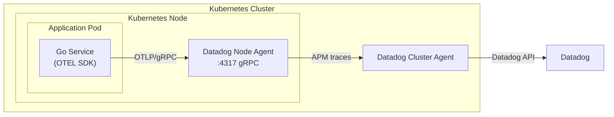
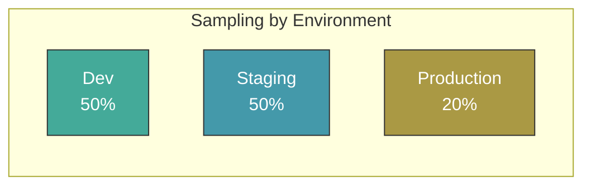
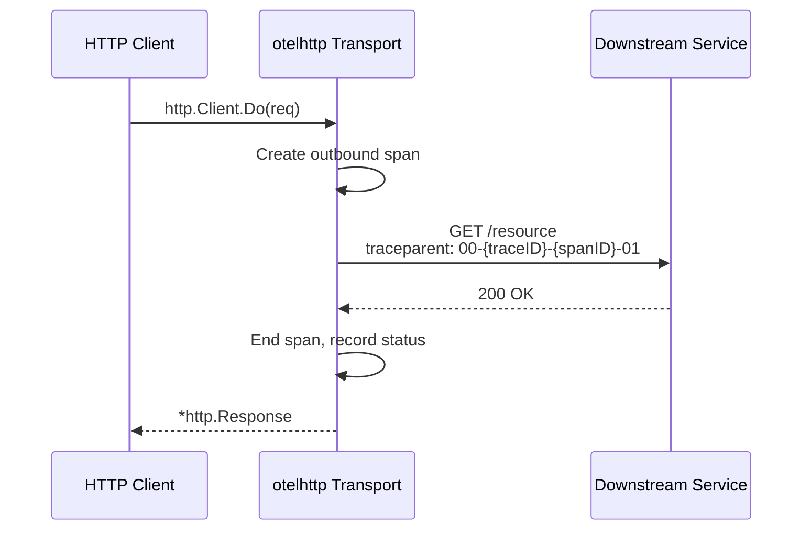
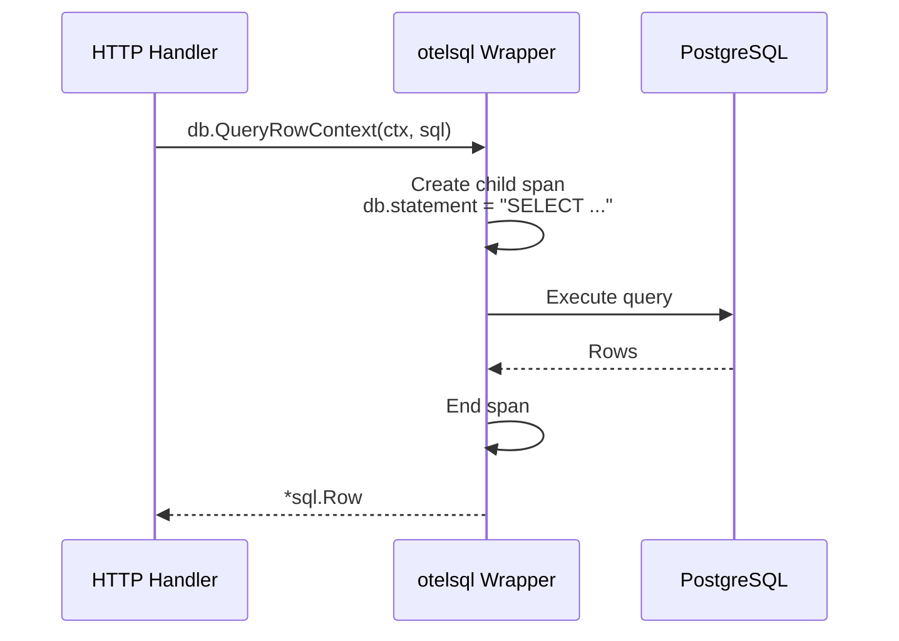

# Distributed Tracing

LFX uses [OpenTelemetry](https://opentelemetry.io/) (OTEL) for distributed
tracing. Traces are collected by the
[Datadog Agent](https://docs.datadoghq.com/opentelemetry/interoperability/otlp_ingest_in_the_agent/)
running on each Kubernetes node and forwarded to Datadog for visualization
and analysis.

Only **traces** are collected via OTEL. Metrics are collected directly by the
Datadog Agent, and logs use a separate pipeline. Trace and span IDs must be
injected into log entries to correlate logs with traces in Datadog.

## Architecture



The LFX Kubernetes platform runs two Datadog components:

- **Datadog Node Agent** — runs as a DaemonSet on every node. Receives OTLP
  traces from pods on the same node via gRPC on port `4317`, and collects
  host-level metrics and logs.
- **Datadog Cluster Agent** — runs as a Deployment (one per cluster).
  Aggregates data from all node agents and forwards it to the Datadog backend.
  Also provides cluster-level metadata enrichment for traces and metrics.

Application pods export traces to the node-local agent using the downward API
`HOST_IP`, keeping trace traffic within the node and off the cluster network.

## Go SDK Setup

LFX Go services use the
[OpenTelemetry Go SDK](https://opentelemetry.io/docs/languages/go/) to
instrument traces. The SDK is configured entirely through environment
variables, requiring no Datadog-specific libraries in application code.

### Required Environment Variables

Set the following environment variables in your Kubernetes deployment:

```yaml
env:
  - name: HOST_IP
    valueFrom:
      fieldRef:
        fieldPath: status.hostIP
  - name: OTEL_SERVICE_NAME
    value: "my-service"
  - name: OTEL_SERVICE_VERSION
    value: "1.0.0"
  - name: OTEL_EXPORTER_OTLP_ENDPOINT
    value: "http://$(HOST_IP):4317"
  - name: OTEL_EXPORTER_OTLP_PROTOCOL
    value: "grpc"
  - name: OTEL_PROPAGATORS
    value: "tracecontext,baggage,jaeger"
  - name: OTEL_TRACES_SAMPLER
    value: "parentbased_traceidratio"
  - name: OTEL_TRACES_SAMPLER_ARG
    value: "0.5"
```

### Variable Reference

| Variable | Description | Example |
|---|---|---|
| `OTEL_SERVICE_NAME` | Identifies the service in Datadog | `query-service` |
| `OTEL_SERVICE_VERSION` | Service version shown in traces | `1.2.0` |
| `OTEL_EXPORTER_OTLP_ENDPOINT` | Datadog Agent OTLP endpoint | `http://$(HOST_IP):4317` |
| `OTEL_EXPORTER_OTLP_PROTOCOL` | Transport protocol | `grpc` |
| `OTEL_PROPAGATORS` | Context propagation formats | `tracecontext,baggage,jaeger` |
| `OTEL_TRACES_SAMPLER` | Sampling strategy | `parentbased_traceidratio` |
| `OTEL_TRACES_SAMPLER_ARG` | Sampling ratio (0.0 - 1.0) | `0.5` |

### Context Propagation

The `OTEL_PROPAGATORS` variable configures which context propagation formats
are used when traces cross service boundaries. LFX services use:

- **tracecontext** - W3C Trace Context (primary standard)
- **baggage** - W3C Baggage for cross-service key-value pairs
- **jaeger** - Jaeger propagation for compatibility

All services must use the same propagator configuration to maintain trace
continuity across service calls.

## Sampling Configuration

Sampling controls what percentage of traces are recorded. LFX uses
`parentbased_traceidratio` which respects the sampling decision of parent
spans and applies ratio-based sampling to root spans.

### Recommended Ratios Per Environment



| Environment | `OTEL_TRACES_SAMPLER_ARG` | Rationale |
|---|---|---|
| Development | `0.5` | High visibility for debugging |
| Staging | `0.5` | Match dev for pre-release validation |
| Production | `0.2` | Balance observability with cost and overhead |

Set the `OTEL_TRACES_SAMPLER_ARG` value per environment in your Helm values
or Kustomize overlays.

## Minimal Go Example

The following example shows the minimum setup for a Go service using
environment-variable-driven configuration:

```go
package main

import (
    "context"
    "log"

    "go.opentelemetry.io/otel"
    "go.opentelemetry.io/otel/exporters/otlp/otlptrace/otlptracegrpc"
    "go.opentelemetry.io/otel/propagation"
    "go.opentelemetry.io/otel/sdk/resource"
    sdktrace "go.opentelemetry.io/otel/sdk/trace"
    "go.opentelemetry.io/contrib/propagators/jaeger"
)

func initTracer(ctx context.Context) (*sdktrace.TracerProvider, error) {
    exporter, err := otlptracegrpc.New(ctx)
    if err != nil {
        return nil, err
    }

    res, err := resource.New(ctx,
        resource.WithFromEnv(),
        resource.WithTelemetrySDK(),
    )
    if err != nil {
        return nil, err
    }

    tp := sdktrace.NewTracerProvider(
        sdktrace.WithBatcher(exporter),
        sdktrace.WithResource(res),
    )

    otel.SetTracerProvider(tp)
    otel.SetTextMapPropagator(propagation.NewCompositeTextMapPropagator(
        propagation.TraceContext{},
        propagation.Baggage{},
        jaeger.Jaeger{},
    ))

    return tp, nil
}

func main() {
    ctx := context.Background()
    tp, err := initTracer(ctx)
    if err != nil {
        log.Fatal(err)
    }
    defer tp.Shutdown(ctx)

    // Application code here
    tracer := otel.Tracer("my-service")
    ctx, span := tracer.Start(ctx, "operation-name")
    defer span.End()
}
```

The OTEL SDK reads `OTEL_EXPORTER_OTLP_ENDPOINT`, `OTEL_SERVICE_NAME`, and
`OTEL_TRACES_SAMPLER`/`OTEL_TRACES_SAMPLER_ARG` from the environment
automatically when using `otlptracegrpc.New(ctx)` and `resource.WithFromEnv()`.

## Trace/Log Correlation

Trace and span IDs must be injected into log entries so that logs can be
linked to their corresponding trace in the observability backend.

### Recommended: slog-otel Handler

The recommended approach is to wrap your `slog` handler with
[`slog-otel`](https://github.com/remychantenay/slog-otel), which automatically
extracts the active trace and span ID from the context and adds them as
standard OTEL attributes to every log record.

```go
import (
    "log/slog"
    "os"

    slogotel "github.com/remychantenay/slog-otel"
)

func initLogger() {
    base := slog.NewJSONHandler(os.Stdout, nil)
    logger := slog.New(slogotel.OtelHandler{Next: base})
    slog.SetDefault(logger)
}
```

With this handler in place, any log call that receives a context containing an
active span automatically includes the trace and span IDs:

```go
// trace_id and span_id are injected automatically
slog.InfoContext(ctx, "processing started", slog.String("user_id", userID))
```

### Manual Injection

If `slog-otel` is not available, extract the IDs directly from the active span:

```go
import (
    "context"
    "log/slog"

    "go.opentelemetry.io/otel/trace"
)

func logWithTrace(ctx context.Context, msg string, args ...any) {
    sc := trace.SpanFromContext(ctx).SpanContext()
    attrs := []any{
        slog.String("trace_id", sc.TraceID().String()),
        slog.String("span_id", sc.SpanID().String()),
    }
    slog.InfoContext(ctx, msg, append(attrs, args...)...)
}
```

Ensure your log pipeline forwards `trace_id` and `span_id` fields without
modification so the observability backend can correlate them with traces.

## Tracing External Requests

### HTTP Client

Use the
[`otelhttp`](https://pkg.go.dev/go.opentelemetry.io/contrib/instrumentation/net/http/otelhttp)
contrib package to automatically create outbound spans and propagate trace
context in HTTP request headers.

```go
import (
    "context"
    "net/http"

    "go.opentelemetry.io/contrib/instrumentation/net/http/otelhttp"
)

var httpClient = &http.Client{
    Transport: otelhttp.NewTransport(http.DefaultTransport),
}

func callDownstream(ctx context.Context, url string) (*http.Response, error) {
    req, err := http.NewRequestWithContext(ctx, http.MethodGet, url, nil)
    if err != nil {
        return nil, err
    }
    // otelhttp injects traceparent/tracestate headers automatically
    return httpClient.Do(req)
}
```

Wrap incoming HTTP handlers the same way to automatically create server-side
spans:

```go
mux := http.NewServeMux()
mux.HandleFunc("/api/resource", handleResource)

handler := otelhttp.NewHandler(mux, "http-server",
    otelhttp.WithMessageEvents(otelhttp.ReadEvents, otelhttp.WriteEvents),
)
http.ListenAndServe(":8080", handler)
```

### HTTP Trace Flow



### Database (SQL)

Use the
[`otelsql`](https://pkg.go.dev/github.com/XSAM/otelsql)
package to wrap a standard `database/sql` driver and automatically trace every
query as a child span.

```go
import (
    "database/sql"

    "github.com/XSAM/otelsql"
    semconv "go.opentelemetry.io/otel/semconv/v1.26.0"
    _ "github.com/lib/pq"
)

func openDB(dsn string) (*sql.DB, error) {
    db, err := otelsql.Open("postgres", dsn,
        otelsql.WithAttributes(semconv.DBSystemPostgreSQL),
    )
    if err != nil {
        return nil, err
    }
    // Record connection pool metrics as span events
    otelsql.RegisterDBStatsMetrics(db,
        otelsql.WithAttributes(semconv.DBSystemPostgreSQL),
    )
    return db, nil
}
```

Pass the request context to every query so spans are attached to the active
trace:

```go
func getUser(ctx context.Context, db *sql.DB, id string) (*User, error) {
    row := db.QueryRowContext(ctx, "SELECT id, name FROM users WHERE id = $1", id)
    var u User
    if err := row.Scan(&u.ID, &u.Name); err != nil {
        return nil, err
    }
    return &u, nil
}
```

Spans are automatically created for each query and include the SQL statement,
database system, and connection details as span attributes.

### Database Trace Flow



## Naming Conventions

Consistent naming makes traces easy to find and understand across services.

### Span Names

Span names should describe the operation, not the implementation. Use the
format `{verb}.{noun}` in lower snake_case:

| Context | Good | Avoid |
|---|---|---|
| HTTP handler | `http.get_user` | `GET /users/{id}` |
| Database query | `db.query_users` | `SELECT * FROM users` |
| Outbound HTTP | `http.post_notification` | `http.post` |
| Business logic | `membership.calculate_fee` | `calculateFee` |

For HTTP servers, `otelhttp` sets the span name to the route pattern
automatically (e.g. `GET /api/users/{id}`). Override with
`otelhttp.WithSpanNameFormatter` if the default is not descriptive enough.

### Span Attributes

Add attributes to spans to make them queryable. Use
[OpenTelemetry semantic conventions](https://opentelemetry.io/docs/specs/semconv/)
where they apply, and `lfx.` prefix for LFX-specific attributes:

```go
span.SetAttributes(
    // Standard semantic convention attributes
    semconv.HTTPRequestMethodKey.String("GET"),
    semconv.UserAgentOriginal(r.Header.Get("User-Agent")),

    // LFX-specific attributes
    attribute.String("lfx.project_id", projectID),
    attribute.String("lfx.org_id", orgID),
    attribute.String("lfx.user_id", userID),
)
```

Required attributes for all root spans:

| Attribute | Source | Example |
|---|---|---|
| `service.name` | `OTEL_SERVICE_NAME` env var | `query-service` |
| `service.version` | `OTEL_SERVICE_VERSION` env var | `1.2.0` |
| `deployment.environment` | Set via `OTEL_RESOURCE_ATTRIBUTES` | `production` |

### Tracer Names

Name the tracer after the package or component that owns it, using the Go
import path convention:

```go
// Use the package path as the tracer name
tracer := otel.Tracer("github.com/linuxfoundation/lfx-v2-query-service/handlers")
```

## Accessing Traces

### Local Development (Jaeger)

In local development, traces are sent to a Jaeger instance running in
OrbStack. Access the Jaeger UI by port-forwarding the Jaeger service:

```bash
kubectl port-forward svc/jaeger-query 16686:16686 -n observability
```

Then open `http://localhost:16686` in your browser.

In the Jaeger UI:

1. Select your service from the **Service** dropdown
2. Optionally filter by **Operation** name
3. Set a time range and click **Find Traces**
4. Click a trace to expand the span waterfall

To find a specific trace by ID (e.g. from a log entry):

1. Paste the trace ID into the **Trace ID** field at the top of the page
2. Press Enter

### Cloud (Datadog APM)

In staging and production, traces are available in
[Datadog APM](https://app.datadoghq.com/apm/traces).

To find traces for a specific service:

1. Navigate to **APM → Traces**
2. Use the **Service** facet on the left to filter by service name
3. Use the **Env** facet to select the environment (`staging`, `production`)
4. Click any trace row to open the flame graph view

To jump from a log entry to its trace:

1. Find the log entry in **Logs**
2. Click the **View Trace** button in the log detail panel (requires
   `trace_id` to be present in the log)

## Common Query Patterns

### Jaeger

| Goal | Query |
|---|---|
| All traces for a service | Service: `query-service`, Operation: `all` |
| Slow requests | Service: `query-service`, Min Duration: `500ms` |
| Failed traces | Tags: `error=true` |
| Traces for a user | Tags: `lfx.user_id=<id>` |
| Traces for a project | Tags: `lfx.project_id=<id>` |

### Datadog APM

| Goal | Query |
|---|---|
| All errors for a service | `service:query-service status:error` |
| Slow database spans | `service:query-service span.type:sql @duration:>1s` |
| Traces by user | `service:query-service @lfx.user_id:<id>` |
| Traces by project | `service:query-service @lfx.project_id:<id>` |
| High latency endpoints | `service:query-service @http.method:GET @duration:>2s` |

Datadog query syntax uses `@` to prefix span attributes. Saved queries can
be stored as **Monitors** or **Dashboards** for ongoing visibility.

## Troubleshooting

### Spans Not Appearing

**Check the exporter endpoint.**

Verify `OTEL_EXPORTER_OTLP_ENDPOINT` is set correctly and that `HOST_IP` is
resolving. Run a debug pod on the same node and test connectivity:

```bash
kubectl run -it --rm debug --image=alpine --restart=Never -- \
  wget -qO- http://<HOST_IP>:4317
```

The Datadog Agent OTLP gRPC port should be reachable. An ECONNREFUSED error
means OTLP ingestion is not enabled on the agent.

**Check that the tracer provider is initialized before use.**

If `initTracer` is not called before the first span is created, the OTEL
global provider is a no-op and spans are silently dropped.

**Verify the Datadog Agent has OTLP enabled.**

The node agent must have the following in its configuration:

```yaml
otlp_config:
  receiver:
    protocols:
      grpc:
        endpoint: 0.0.0.0:4317
```

### Traces Are Incomplete or Missing Spans

**Missing context propagation.** If a downstream service does not receive the
`traceparent` header, it starts a new root trace instead of continuing the
existing one. Ensure:

- All HTTP clients use `otelhttp.NewTransport`
- All HTTP servers use `otelhttp.NewHandler`
- gRPC clients/servers use the `otelgrpc` interceptors

**Sampling mismatch.** If the downstream service uses a lower sample rate than
the upstream, some child spans may be dropped. The `parentbased_traceidratio`
sampler respects the parent's sampling decision, so ensure all services use it.

### Sampling Not Taking Effect

Confirm `OTEL_TRACES_SAMPLER=parentbased_traceidratio` and
`OTEL_TRACES_SAMPLER_ARG` are both set. If `OTEL_TRACES_SAMPLER_ARG` is
missing, the SDK defaults to `1.0` (100% sampling).

### High Trace Volume in Production

If trace volume is unexpectedly high, check that `OTEL_TRACES_SAMPLER_ARG`
is set to `0.2` (20%) in the production environment. Use the Datadog APM
ingestion control page to review per-service rates and apply an ingestion
filter if needed.

### Trace/Log Correlation Not Working

Datadog requires the log source to be identified correctly before it can
correlate logs with traces. Set the following pod annotation to declare the
log source for your service:

```yaml
annotations:
  ad.datadoghq.com/<container-name>.logs: |
    [{"source": "go", "service": "my-service"}]
```

Replace `<container-name>` with the name of the container in the pod spec,
and `my-service` with the value of `OTEL_SERVICE_NAME`. Without this
annotation, Datadog may not match log entries to the correct service in APM.

## Trace Flow Summary

- [OpenTelemetry Go SDK](https://opentelemetry.io/docs/languages/go/)
- [OTEL Environment Variable Spec](https://opentelemetry.io/docs/specs/otel/configuration/sdk-environment-variables/)
- [Datadog OTLP Ingestion](https://docs.datadoghq.com/opentelemetry/interoperability/otlp_ingest_in_the_agent/)
- [W3C Trace Context](https://www.w3.org/TR/trace-context/)
- [slog-otel](https://github.com/remychantenay/slog-otel) - slog handler for OTEL trace/log correlation
- [otelhttp](https://pkg.go.dev/go.opentelemetry.io/contrib/instrumentation/net/http/otelhttp) - HTTP client/server instrumentation
- [otelsql](https://pkg.go.dev/github.com/XSAM/otelsql) - database/sql instrumentation
- [OpenTelemetry Semantic Conventions](https://opentelemetry.io/docs/specs/semconv/) - standard span attribute names
- [Datadog APM](https://app.datadoghq.com/apm/traces) - cloud trace explorer
- [Datadog Cluster Agent](https://docs.datadoghq.com/containers/cluster_agent/) - cluster-level Datadog component
