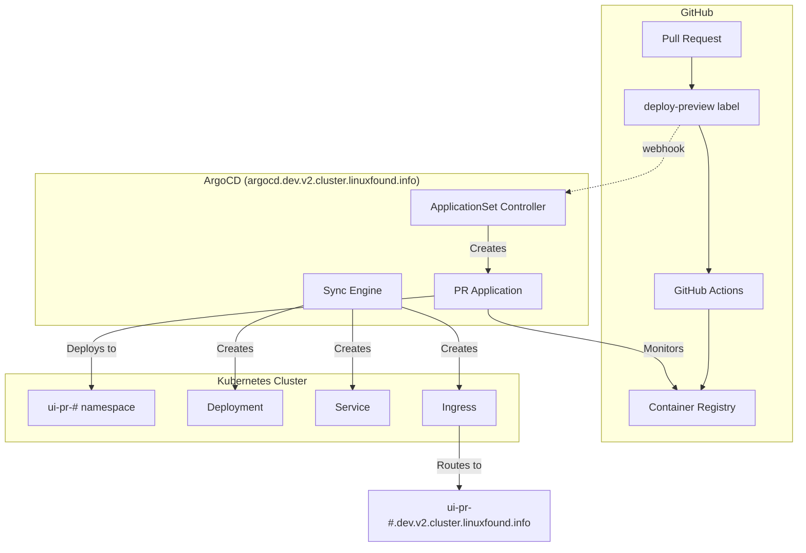
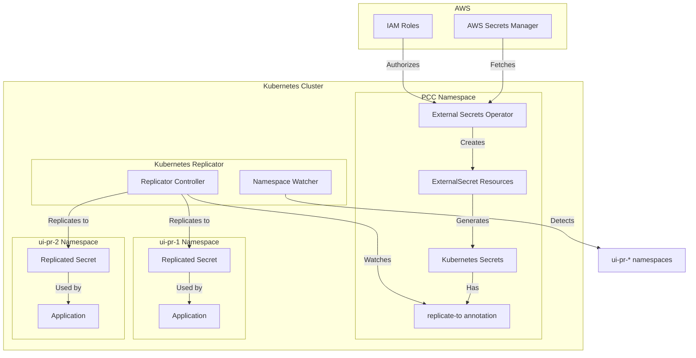

# LFX V2 Deploy Preview Architecture

## Overview

This document outlines the automated deploy preview system for the LFX
V2 UI, which enables developers to test pull request changes in isolated
Kubernetes environments before merging. The system leverages ArgoCD for
GitOps-based deployments, GitHub for source control and CI/CD, and
Kubernetes for hosting the preview environments.

**NOTE:** All deployment previews use the same LFX backend API.
Additional changes are needed in the future to support deploying
different versions of the API and it's components.

## Key Components

### Repository Configurations

#### lfx-v2-argocd

**Purpose:** Manages ArgoCD configurations and ApplicationSets for
  automated PR deployments

**Key Features:**

- **ExternalSecrets Annotation:** Annotates base UI application external
    secrets with kubernetes-replicator `replicate-to` labels to
    automatically create secrets in `ui-pr-{number}` namespaces
- **ApplicationSet Controller:** Watches LFX V2 UI Pull Requests on
    GitHub and automatically creates new UI applications in dedicated
    namespaces (`ui-pr-{number}`)

#### lfx-v2-ui

**Purpose:** Main UI repository with CI/CD pipeline for deploy previews

**Key Features:**

- **CI/CD Pipeline:** Automated container builds triggered by the
  `deploy-preview` label on pull requests
- **ArgoCD Webhook Integration:** Sends notifications to ArgoCD
  ApplicationSet controller when labels are added (prevents up to
  30-minute delay from polling interval)

#### lfx-v2-opentofu

**Purpose:** Infrastructure as Code for Kubernetes operators and
supporting services

**Key Features:**

- **Kubernetes Replicator Deployment:** Helm-based deployment of the
  kubernetes-replicator operator
- **Secret Replication:** Enables automatic replication of secrets from
  the PCC namespace to dynamically created `ui-pr-*` namespaces

#### auth0_terraform

**Purpose:** Auth0 identity provider configuration for deploy previews

**Key Features:**

- **Dynamic Callback URLs:** PCC application configured with wildcard
  callback and audience URLs supporting
  `ui-pr-*.dev.v2.cluster.linuxfound.info`
- **Authentication:** Ensures authentication works seamlessly across all PR
  preview environments

## Architecture Diagrams

### ArgoCD and GitHub Integration

### Secrets Management Architecture

## Workflow

1. **Developer creates PR:** A pull request is opened in the lfx-v2-ui repository
2. **Label Application:** Developer or reviewer adds the `deploy-preview` label
3. **Container Build:** GitHub Actions builds and pushes a container image tagged with the PR number
4. **ArgoCD Notification:** Webhook notifies ArgoCD ApplicationSet controller (avoids polling delay)
5. **Application Creation:** ApplicationSet creates a new ArgoCD application for the PR
6. **Namespace Setup:** Kubernetes namespace `ui-pr-{number}` is created
7. **Secret Replication:** Kubernetes-replicator copies necessary secrets from PCC namespace
8. **Deployment:** ArgoCD deploys the application with the PR-specific container image
9. **Access:** Preview available at `ui-pr-{number}.dev.v2.cluster.linuxfound.info`

## Security Considerations

- All deploy previews use the same Auth0 tenant with wildcard configurations
- Secrets are replicated only to authorized `ui-pr-*` namespaces
- Each PR environment is isolated in its own Kubernetes namespace
- AWS IAM roles restrict secret access to authorized services only
- Deploy preview environments are automatically cleaned up when PRs are closed
