# LFX V2 Secrets Management

This document provides comprehensive guidance for managing secrets in the LFX V2 platform using the centralized
[lfx-secrets-management](https://github.com/linuxfoundation/lfx-secrets-management) repository.

## Table of Contents

- [Overview](#overview)
  - [Integration with Service Accounts](#integration-with-service-accounts)
  - [Secrets Flow Architecture](#secrets-flow-architecture)
- [Prerequisites](#prerequisites)
- [Configuration Requirements](#configuration-requirements)
  - [Tags](#tags)
  - [Service Tag Integration](#service-tag-integration)
  - [Vault Requirements](#vault-requirements)
  - [AWS Destination Accounts](#aws-destination-accounts)
  - [Region](#region)
  - [Path Format](#path-format)
- [Step-by-Step Process](#step-by-step-process)
  - [1. Add Secret to 1Password](#1-add-secret-to-1password)
  - [2. Create YAML Configuration](#2-create-yaml-configuration)
  - [3. Submit Pull Request](#3-submit-pull-request)
  - [4. Deploy Secrets](#4-deploy-secrets)
  - [5. Using the Secret in Kubernetes](#5-using-the-secret-in-kubernetes)
  - [6. Add Secrets Store, External Secrets, and Service Account](#6-add-secrets-store-external-secrets-and-service-account)
- [Configuration Example](#configuration-example)
  - [Configuration Breakdown](#configuration-breakdown)
- [Deployment Methods](#deployment-methods)
  - [Using GitHub Actions](#using-github-actions)
- [Validation and Testing](#validation-and-testing)
  - [Verify Deployment](#verify-deployment)
  - [Test Service Access](#test-service-access)
  - [Audit Secrets](#audit-secrets)
- [Best Practices](#best-practices)
  - [Security Considerations](#security-considerations)
  - [Naming Conventions](#naming-conventions)
  - [Environment Management](#environment-management)
  - [Change Management](#change-management)
- [Troubleshooting](#troubleshooting)
  - [Common Issues](#common-issues)
  - [Getting Help](#getting-help)

## Overview

LFX V2 uses an automated secrets management system that synchronizes secrets between 1Password vaults and
AWS Secrets Manager across different environments. This approach ensures:

- **Centralized Management**: All secrets are managed through a single repository
- **Environment Isolation**: Separate vaults and AWS accounts for dev, staging, and production
- **Automated Deployment**: Secrets are deployed using GitHub Actions or local tooling
- **Security**: Secrets never leave secure storage systems during transit

### Integration with Service Accounts

LFX V2 services automatically consume secrets through a tag-based system managed by the platform's
infrastructure. Each service has a dedicated IAM role and Kubernetes service account that can only access
secrets tagged with their specific service identifier. For detailed information about how services consume
these secrets, see the [Service Account Management documentation](https://github.com/linuxfoundation/lfx-v2-opentofu/blob/main/docs/service-accounts.md).

**Key Integration Points:**

- **Tag-Based Access**: Services only access secrets tagged with their service name
- **External Secrets Operator**: Automatically discovers and merges secrets into Kubernetes
- **IRSA Authentication**: Secure role assumption without storing credentials
- **10-minute Refresh**: Secrets are automatically refreshed every 10 minutes

### Secrets Flow Architecture

The following diagram illustrates how secrets flow from 1Password through to application deployment:

```mermaid
graph TB
    subgraph "1Password Vaults"
        OP1["LFX V2 - Development<br/>📦 Secret Item"]
        OP2["LFX V2 - Staging<br/>📦 Secret Item"]
        OP3["LFX V2 - Production<br/>📦 Secret Item"]
    end

    subgraph "Secrets Management Repository"
        YAML["YAML Configuration<br/>🔧 secretsmanagement/secrets/cloud.yml"]
        GA["GitHub Actions<br/>🚀 Deploy Workflow"]
    end

    subgraph "AWS Secrets Manager"
        ASM1["us-west-2<br/>lfx-development<br/>🔐 /cloud/litellm/lfx-v2<br/>🏷️ service: pcc"]
        ASM2["us-west-2<br/>lfx-staging<br/>🔐 /cloud/litellm/lfx-v2<br/>🏷️ service: pcc"]
        ASM3["us-west-2<br/>lfx-production<br/>🔐 /cloud/litellm/lfx-v2<br/>🏷️ service: pcc"]
    end

    subgraph "Development Cluster"
        subgraph "Dev Service Account & IRSA"
            SA1["pcc-sa<br/>🔑 Service Account<br/>📋 Role: k8s-secret-access-pcc"]
        end

        subgraph "Dev External Secrets"
            SS1["pcc-secret-store<br/>🏪 SecretStore<br/>🔗 Uses IRSA"]
            ES1["pcc-secrets<br/>📊 ExternalSecret<br/>🏷️ Filters by service: pcc<br/>⏱️ Refreshes every 10m"]
        end

        subgraph "Dev Kubernetes Secrets"
            KS1["pcc-secrets<br/>🔒 K8s Secret<br/>📝 Merged secret values"]
        end

        subgraph "Dev Application"
            DEP1["pcc-deployment<br/>🚀 Deployment<br/>📌 serviceAccountName: pcc-sa<br/>🔗 secretRef: pcc-secrets"]
            POD1["Pod<br/>🏃 Running Container<br/>🌍 Environment Variables<br/>LITELLM_API_KEY=***"]
        end
    end

    subgraph "Staging Cluster"
        subgraph "Staging Service Account & IRSA"
            SA2["pcc-sa<br/>🔑 Service Account<br/>📋 Role: k8s-secret-access-pcc"]
        end

        subgraph "Staging External Secrets"
            SS2["pcc-secret-store<br/>🏪 SecretStore<br/>🔗 Uses IRSA"]
            ES2["pcc-secrets<br/>📊 ExternalSecret<br/>🏷️ Filters by service: pcc<br/>⏱️ Refreshes every 10m"]
        end

        subgraph "Staging Kubernetes Secrets"
            KS2["pcc-secrets<br/>🔒 K8s Secret<br/>📝 Merged secret values"]
        end

        subgraph "Staging Application"
            DEP2["pcc-deployment<br/>🚀 Deployment<br/>📌 serviceAccountName: pcc-sa<br/>🔗 secretRef: pcc-secrets"]
            POD2["Pod<br/>🏃 Running Container<br/>🌍 Environment Variables<br/>LITELLM_API_KEY=***"]
        end
    end

    subgraph "Production Cluster"
        subgraph "Prod Service Account & IRSA"
            SA3["pcc-sa<br/>🔑 Service Account<br/>📋 Role: k8s-secret-access-pcc"]
        end

        subgraph "Prod External Secrets"
            SS3["pcc-secret-store<br/>🏪 SecretStore<br/>🔗 Uses IRSA"]
            ES3["pcc-secrets<br/>📊 ExternalSecret<br/>🏷️ Filters by service: pcc<br/>⏱️ Refreshes every 10m"]
        end

        subgraph "Prod Kubernetes Secrets"
            KS3["pcc-secrets<br/>🔒 K8s Secret<br/>📝 Merged secret values"]
        end

        subgraph "Prod Application"
            DEP3["pcc-deployment<br/>🚀 Deployment<br/>📌 serviceAccountName: pcc-sa<br/>🔗 secretRef: pcc-secrets"]
            POD3["Pod<br/>🏃 Running Container<br/>🌍 Environment Variables<br/>LITELLM_API_KEY=***"]
        end
    end

    %% Flow connections
    OP1 --> YAML
    OP2 --> YAML
    OP3 --> YAML

    YAML --> GA
    GA --> ASM1
    GA --> ASM2
    GA --> ASM3

    %% Development cluster flows
    ASM1 --> SS1
    SA1 --> SS1
    SS1 --> ES1
    ES1 --> KS1
    KS1 --> DEP1
    SA1 --> DEP1
    DEP1 --> POD1

    %% Staging cluster flows
    ASM2 --> SS2
    SA2 --> SS2
    SS2 --> ES2
    ES2 --> KS2
    KS2 --> DEP2
    SA2 --> DEP2
    DEP2 --> POD2

    %% Production cluster flows
    ASM3 --> SS3
    SA3 --> SS3
    SS3 --> ES3
    ES3 --> KS3
    KS3 --> DEP3
    SA3 --> DEP3
    DEP3 --> POD3

    %% Styling
    classDef onepassword fill:#0f62fe,stroke:#0f62fe,stroke-width:2px,color:#fff
    classDef secrets fill:#ff6b35,stroke:#ff6b35,stroke-width:2px,color:#fff
    classDef aws fill:#ff9500,stroke:#ff9500,stroke-width:2px,color:#fff
    classDef k8s fill:#326ce5,stroke:#326ce5,stroke-width:2px,color:#fff
    classDef app fill:#2d5016,stroke:#2d5016,stroke-width:2px,color:#fff

    class OP1,OP2,OP3 onepassword
    class YAML,GA secrets
    class ASM1,ASM2,ASM3 aws
    class SA1,SS1,ES1,KS1,SA2,SS2,ES2,KS2,SA3,SS3,ES3,KS3 k8s
    class DEP1,POD1,DEP2,POD2,DEP3,POD3 app
```



**Flow Explanation:**

1. **Source**: Secrets are stored in environment-specific 1Password vaults
2. **Configuration**: YAML files define the secret mapping and deployment rules
3. **Deployment**: GitHub Actions deploy secrets to AWS Secrets Manager with appropriate tags
4. **Discovery**: External Secrets Operator uses IRSA to authenticate and discover tagged secrets
5. **Synchronization**: Secrets are merged into Kubernetes secrets and refreshed every 10 minutes
6. **Consumption**: Applications reference the service account and secret to access environment variables

## Prerequisites

Before managing secrets for LFX V2, ensure you have:

- Access to the appropriate 1Password vaults (see [Vault Requirements](#vault-requirements))
- AWS access to the target environments
- Contributor access to the [lfx-secrets-management](https://github.com/linuxfoundation/lfx-secrets-management) repository
- Understanding of the service architecture and which backend services will consume the secrets

## Configuration Requirements

### Tags

Every secret configuration **must** include these tags:

- `lfx_v2` - Identifies the secret as belonging to LFX V2
- `<upstream_service>` - The third-party service providing the secret (e.g., `litellm`, `stripe`, `zoom`)
- `<backend_service>` - The LFX V2 service that will consume the secret (e.g., `pcc`)

**Example tags:**

```yaml
tags: [lfx_v2, litellm, pcc]
```

#### Service Tag Integration

The `<backend_service>` tag is critical as it determines which Kubernetes service accounts can access the
secret. When secrets are deployed to AWS Secrets Manager, they receive a `service` tag that matches your
backend service name (e.g., `service: pcc`). The LFX V2 infrastructure then uses this tag to:

1. **Control Access**: Only the matching service's IAM role can retrieve the secret. I.e the `pcc-sa`
   service account uses role `arn:aws:iam::788942260905:role/k8s-secret-access-pcc` in dev to only
   access specific tagged secrets that match `"aws:ResourceTag/service": "pcc"`
2. **Auto-Discovery**: The External Secrets Operator automatically finds and merges all secrets with the service tag
3. **Environment Variables**: All tagged secrets are made available as environment variables in the service's pods

For the complete technical details of this integration, refer to the
[Service Account Management documentation](https://github.com/linuxfoundation/lfx-v2-opentofu/blob/main/docs/service-accounts.md).

### Vault Requirements

Secrets must first be stored in the appropriate 1Password vault:

| Environment | 1Password Vault |
|-------------|-----------------|
| Development | `LFX V2 - Development` |
| Staging | `LFX V2 - Staging` |
| Production | `LFX V2 - Production` |

The name of the secret item should be the same in all vaults it is configured for and match the
`source.onepassword.item` field in the configuration.

### AWS Destination Accounts

Secrets are deployed to these AWS accounts by environment:

| Environment | AWS Account |
|-------------|-------------|
| Development | `lfx-development` |
| Staging | `lfx-staging` |
| Production | `lfx-production` |

**Note**: Secrets do **not** need to be added to `prdct-*` accounts.

### Region

All secrets are stored in the **us-west-2** region.

### Path Format

Secrets follow this path convention in AWS Secrets Manager:

```text
path: cloud/<3rd_party_service>/<name_or_identifier>
```

They are automatically prefixed with `/cloudops/managed-secrets/` when created.

The name pattern here does not matter as much as the tags do, which determine which secret
store a secret is pulled into.

**Examples:**

- `cloud/LiteLLM/lfx-v2`
- `cloud/zoom/lfx-v2-meeting-service`
- `cloud/supabase/api_key`

## Step-by-Step Process

### 1. Add Secret to 1Password

First, add your secret to the appropriate 1Password vault:

1. Open 1Password and navigate to the correct vault (see [Vault Requirements](#vault-requirements))
2. Create a new item or update an existing one
3. Use type `API Credentials`
4. Include all necessary fields (API keys, tokens, etc.)
5. The chosen field names will be used as keys in the AWS secret in and ultimately in the k8s secret
   too. For example, `LiteLLM LFXv2 Key` has fields `litellm-key-id` and `litellm-api-key` and has
   `source.onepassword.json_fields` set to `['litellm-key-id', 'litellm-api-key']`.
6. Use a descriptive name that identifies the service and purpose.

### 2. Create YAML Configuration

Navigate to the [lfx-secrets-management](https://github.com/linuxfoundation/lfx-secrets-management)
repository and create or update a YAML configuration file in the `secretsmanagement/secrets/` directory.

Do this via a new branch and pull request against the `main` branch.

### 3. Submit Pull Request

Create a pull request with your configuration changes following the repository's contribution guidelines.

### 4. Deploy Secrets

Once approved and merged, the secrets will be deployed via
[**GitHub Actions**](https://github.com/linuxfoundation/lfx-secrets-management/actions/workflows/deploy.yml)

**If the secrets store and external secrets operator are already set up, the secrets will be automatically
available to the service if tagged correctly.**

### 5. Using the Secret in Kubernetes

The secret, once ingested, can be used by your deployments by reference. Here's an example snippet of a deployment manifest:

```yaml
env:
{{- range $name, $config := .Values.environment }}
- name: {{ $name }}
  {{- if $config.value }}
  value: {{ $config.value | quote }}
  {{- else if $config.valueFrom }}
  valueFrom:
    {{- toYaml $config.valueFrom | nindent 14 }}
  {{- end }}
{{- end }}
```

and the in the corresponding `values.yaml`:

```yaml
environment:
  LITELLM_API_KEY:
    valueFrom:
      secretKeyRef:
        name: pcc-secrets
        key: litellm-api-key
  LITELLM_KEY_ID:
    valueFrom:
      secretKeyRef:
        name: pcc-secrets
        key: litellm-key-id
```

The above is dependent on how the helm chart is set up.

### 6. Add Secrets Store, External Secrets, and Service Account

TODO: Add documentation on configuring a new Secrets Store, External Secret, and Service Account.

## Configuration Example

Based on the [LiteLLM implementation](https://github.com/linuxfoundation/lfx-secrets-management/pull/96),
here's a complete configuration example:

```yaml
LiteLLM API key for LFXv2:
  tags: [lfx_v2, litellm, pcc]
  environments: [development, staging, production]
  source:
    onepassword:
      vaults:
        development: LFX V2 - Development
        staging: LFX V2 - Staging
        production: LFX V2 - Production
      item: LiteLLM LFXv2 Key
      json_fields:
        - litellm-key-id
        - litellm-api-key
  destinations:
    - aws_secretsmanager:
        tags:
          service: pcc
        accounts:
          development: lfx-development
          staging: lfx-staging
          production: lfx-production
        regions:
          - us-west-2
        path: cloud/litellm/lfx-v2
```

### Configuration Breakdown

- **Name**: Descriptive title for the secret configuration
- **Tags**: Must include `lfx_v2`, upstream service (`litellm`), and backend service (`pcc`)
- **Environments**: List of environments where this secret should be deployed
- **Source**: 1Password configuration with vault mappings and item details
- **source.onepassword.json_fields**: Specifies which fields from the 1Password item to include in the secret
- **source.onepassword.vaults**: Maps environments to their respective 1Password vaults
- **source.onepassword.item**: Name of the 1Password item containing the secret, must match exactly in all vaults
- **Destinations**: AWS Secrets Manager configuration with accounts, regions, and path
- **destinations.aws_secretsmanager.tags.service**: Tags the secret and determines if a secret gets
  pulled into a service's secret store
- **destinations.aws_secretsmanager.accounts**: Maps environments to AWS accounts, always use lfx-*
  accounts for LFX V2

## Deployment Methods

### Using GitHub Actions

1. Navigate to the
   [Deploy Workflow](https://github.com/linuxfoundation/lfx-secrets-management/actions/workflows/deploy.yml)
2. Click "Run workflow"
3. Enter space-separated values:
   - **Tags**: Include your tags (e.g., `lfx_v2 litellm pcc`)
   - **Environments**: Specify target environments (e.g., `development staging production`)

## Validation and Testing

### Verify Deployment

After deployment, verify the secret exists in AWS Secrets Manager:

1. Access the AWS Console for the target environment
2. Navigate to AWS Secrets Manager in the us-west-2 region
3. Search for your secret using the configured path
4. Verify the secret contains the expected values

### Test Service Access

Ensure your LFX V2 services can access the secret:

1. Update service configuration to reference the secret path
2. Test the service in a non-production environment
3. Monitor logs for any access issues
4. Verify the secret values are correctly retrieved

### Audit Secrets

Use the secrets management repository's audit functionality:

```bash
# Audit all secrets
make audit

# Audit specific environment
make audit ENVS="development"

# Audit specific AWS accounts
make audit-aws ACCOUNTS="lfx-development"
```

## Best Practices

### Security Considerations

- **Never store secrets in plain text** in any repository or configuration file
- **Use environment-specific vaults** to prevent accidental cross-environment access
- **Rotate secrets regularly** according to your organization's security policy
- **Monitor secret access** using AWS CloudTrail and 1Password audit logs

### Naming Conventions

- Use descriptive names that clearly identify the service and purpose
- Include version numbers or identifiers when managing multiple versions
- Follow consistent naming patterns across all LFX V2 secrets

### Environment Management

- **Always test in development first** before deploying to staging or production
- **Use the plan mode** (`--plan` flag) to verify changes before deployment
- **Deploy incrementally** (dev → staging → production) to catch issues early

### Change Management

- **Create pull requests** for all secret configuration changes
- **Include detailed descriptions** of what secrets are being added or modified
- **Tag relevant team members** for review, especially for production secrets
- **Document any service configuration changes** required to use the new secrets

## Troubleshooting

### Common Issues

**Secret not found in AWS:**

- Verify the secret was successfully deployed using the audit commands
- Check that the path matches your service configuration exactly
- Ensure the secret was deployed to the correct AWS account and region

**1Password access errors:**

- Verify you have access to the correct vault for your environment
- Check that the item name and field names match your configuration exactly
- Ensure the 1Password service account has appropriate permissions

**Deployment failures:**

- Review the deployment logs in GitHub Actions or local output
- Verify your configuration YAML syntax is correct
- Check that all required tags and fields are present

### Getting Help

For additional support:

- Review the [lfx-secrets-management repository documentation](https://github.com/linuxfoundation/lfx-secrets-management/blob/main/README.md)
- Check existing issues and discussions in the repository
- Contact the LFX engineering team through established channels
- Reference the
  [services documentation](https://github.com/linuxfoundation/lfx-secrets-management/blob/main/secretsmanagement/services/README.md)
  for service-specific guidance
