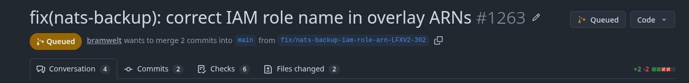
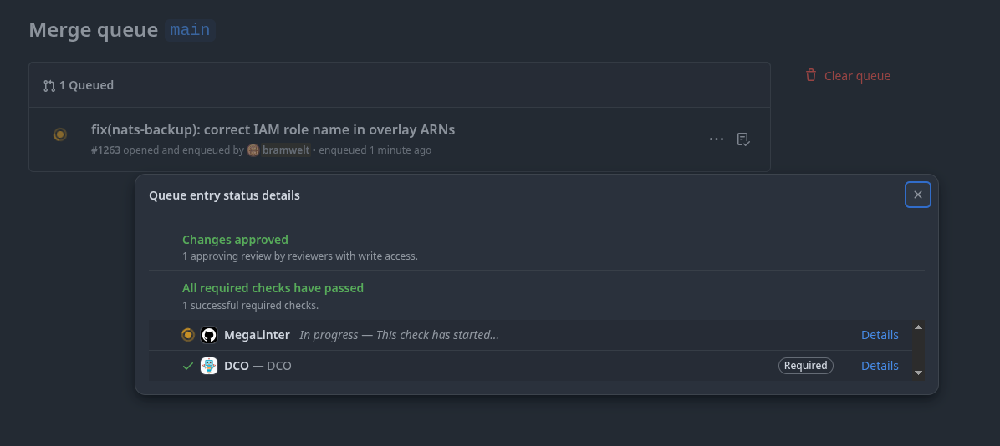
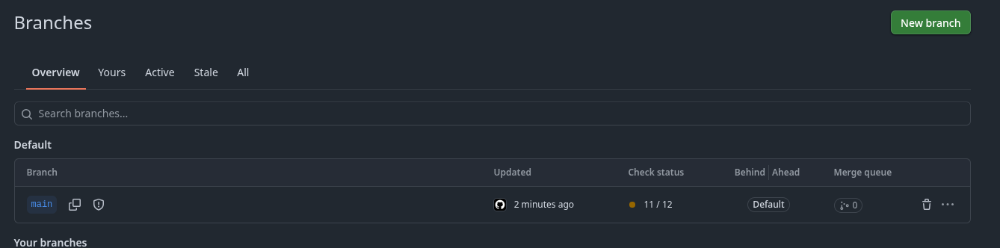

# GitHub Merge Queues

## Overview

A merge queue serializes merges into a protected branch (usually `main`) and
re-tests each pull request against the branch *plus every pull request already
ahead of it in the queue*, instead of just against the branch as it was when
the pull request was last updated. Without a merge queue, two pull requests can
each pass CI individually, against a slightly stale `main`, and still break
`main` once both are merged because they conflict with each other in a way
neither author's CI run could see. The merge queue closes that gap: what CI
validates is what actually lands.

## How It Works

1. A pull request is approved and its required checks pass against its own
  branch.
2. The author (or anyone with merge permission) adds the pull request to the
  queue.
3. GitHub creates a temporary branch (visible as
  `gh-readonly-queue/<base>/pr-<number>-<sha>`) containing the base branch plus
  every pull request already queued ahead of this one, plus this pull
  request's changes.
4. Required checks run against that temporary branch, not the pull request's
  own branch.
5. If checks pass, the pull request merges into the base branch and leaves the
  queue.

Entries near the front of the queue are frequently tested speculatively and in
parallel rather than strictly one-at-a-time, so a short queue often drains
faster than "N entries times one check run."

## Adding a Pull Request to the Queue

The pull request must already satisfy branch protection: required approvals in
place and required checks passing on the pull request's own branch. Once that
is true:

- From the pull request page, use the merge button (**Merge when ready** on
  repositories with a merge queue enabled), or
- From the CLI: `gh pr merge --auto`.

Once queued, the pull request header shows an amber **Queued** badge next to
the title, replacing the usual merge button:

## Removing a Pull Request from the Queue

A pull request leaves the queue if any of the following happen:

- You remove it manually, either from the pull request page or from the `...`
  overflow menu on its entry on the Merge queue page.
- You push a new commit to the pull request branch — queued entries are
  removed automatically on new pushes, since the entry no longer reflects what
  would be merged.
- A repository admin uses **Clear queue** (top-right of the Merge queue page)
  to drop every entry at once. This is a broad, admin-level action — use it
  deliberately, not to unblock a single stuck pull request.

## What Happens When a Pull Request in the Middle Fails

This is the behavior a merge queue exists to handle:

- The failing pull request is removed from the queue and its author is
  notified.
- Pull requests **ahead** of the failing one are unaffected — they were
  already tested without the failing change and keep merging normally.
- Pull requests **behind** the failing one are rebuilt and retested without the
  failing change, since the queue removed it from the base they are tested
  against. In most cases they merge without the author needing to do anything.

Practical consequence: if your queued pull request shows a failed check, the
failure may belong to a pull request that was ahead of you in the queue, not to
your own commit. Open the entry's **Queue entry status details** to see exactly
which check failed and against which combination of pull requests, before
assuming your own change is at fault. A dequeued pull request must have its
issue fixed and be re-added to the queue — it does not retry automatically.

## Viewing the Current Queue

Two places show what is queued:

- **Merge queue page** — `https://github.com/<org>/<repo>/queue/<branch>`.
  Lists every entry with its position, who enqueued it, and how long ago.
  Clicking an entry opens **Queue entry status details**, showing approval
  status and the state of each required check (for example `MegaLinter` still
  running, `DCO` already passed):

  

- **Branches page** — `https://github.com/<org>/<repo>/branches`. The
  **Merge queue** column shows a live count of queued entries per branch, the
  fastest way to check whether `main` has anything queued without opening the
  queue page:

  

## Tips

- Don't force-push a branch while its pull request is queued — the entry is
  removed automatically, and you will need to re-add it.
- Required checks must be configured to also run on `merge_group` trigger
  events (not only `pull_request`), or a queued entry can hang waiting on a
  check that never runs against the temporary queue branch.
- Queue position is not a guarantee of merge order: if an entry ahead of yours
  fails and is removed, entries behind it are retested and may merge sooner
  than their original position suggested.
