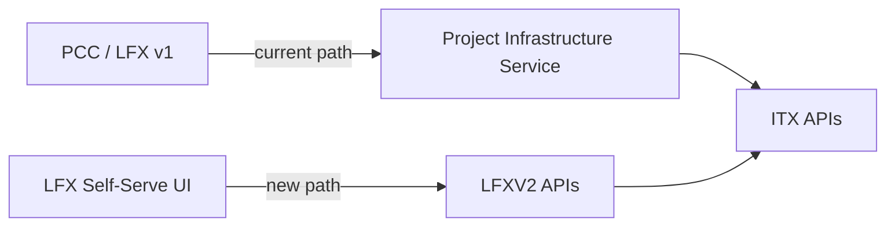
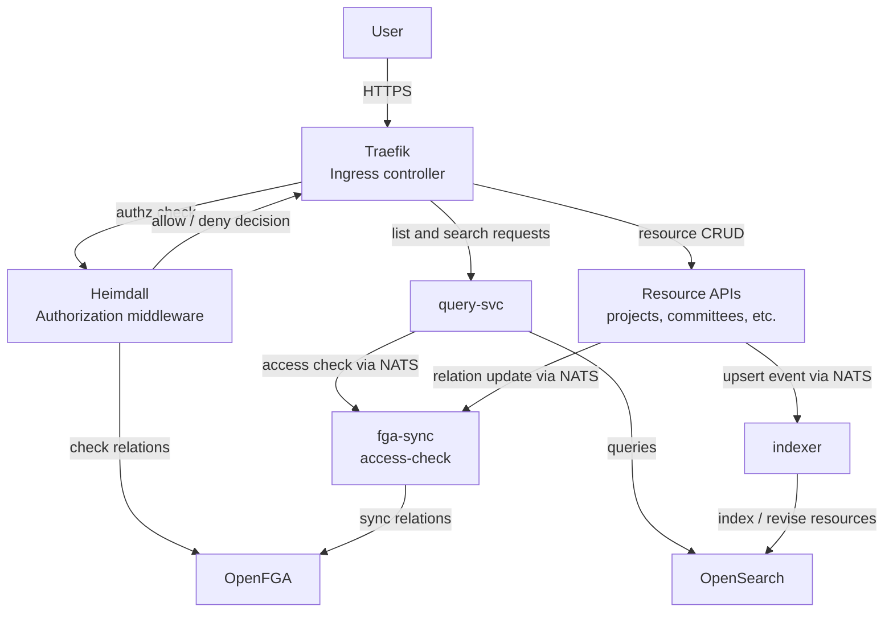
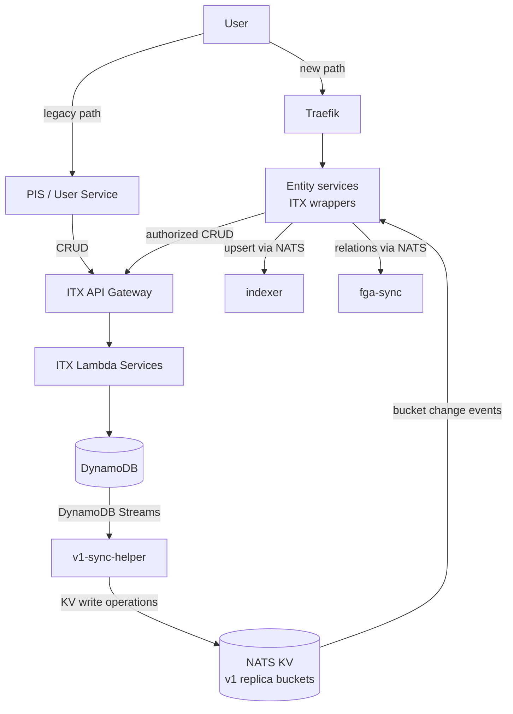
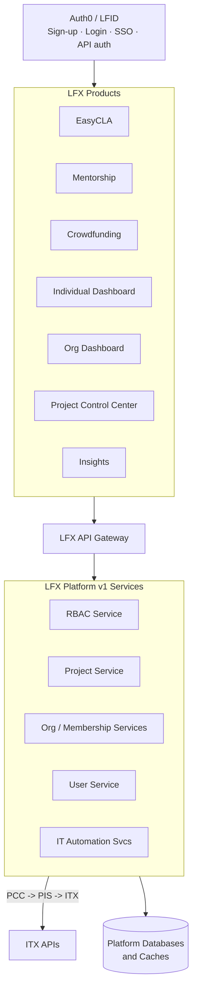
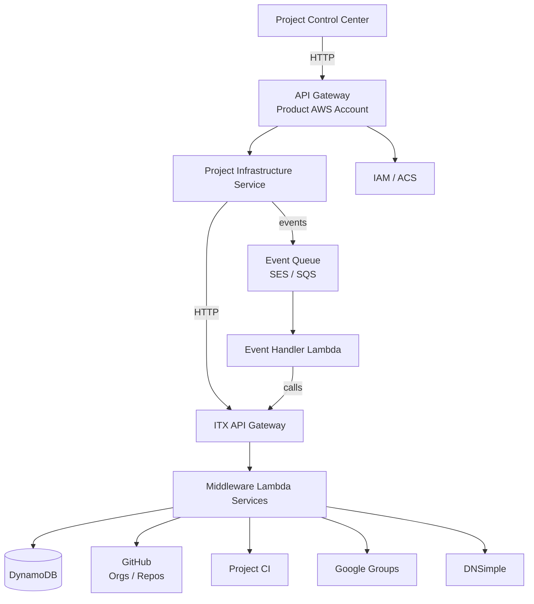

<!--
Copyright The Linux Foundation and its contributors.
SPDX-License-Identifier: CC-BY-4.0
-->

# LFX Platform Overview

Welcome to LFX! This guide is your starting point for understanding what the LFX platforms are,
how they relate to each other, and where to find things as a new contributor.

## Introduction

**LFX** is The Linux Foundation's suite of tools for managing open-source projects, communities,
and contributors. It spans three layered platforms built up over time:

| Layer | Name | Status |
|-------|------|--------|
| LFX-v2 | [LFXV2 (LFX on Kubernetes)](#lfxv2-lfx-on-kubernetes) | In active development, replacing v1 |
| LFX-v1 | [PCC / LFX Platform v1](#pcc--lfx-platform-v1) | Active, serving all LFX products |
| ITX | [ITX (IT Automation)](#itx-it-automation) | Backend powering both v1 and v2 |

### How the platforms relate

- **LFXV2** wraps ITX for data storage and mutations. It adds v2-native authorization (OpenFGA)
  and search (OpenSearch) on top without a full data migration.
- **PCC / LFX v1** reaches ITX through the Project Infrastructure Service (PIS).
- Both platforms authenticate users through **Auth0 / LFID**.



---

## LFXV2 (LFX on Kubernetes)

LFXV2 is the next-generation LFX platform running on Amazon EKS. It replaces PCC/LFX v1 with a
cloud-native, Kubernetes-based architecture. Resource APIs are written in Go using the
[Goa framework](https://goa.design/). New LFX features are built here first.

### Architecture: K8s platform services



### Architecture: ITX wrapper pattern

LFXV2 resource APIs act as *wrappers* over ITX. They delegate data storage to ITX, while
providing v2-native authorization (OpenFGA) and search (OpenSearch) on top.



The `v1-sync-helper` service consumes DynamoDB Streams and replicates ITX data into NATS KV
buckets. This gives wrapper services both a cache and exhaustive eventing, without requiring
any v2-compatible eventing to be added to ITX code.

### Key components

| Component | Role |
|-----------|------|
| **Traefik** | Ingress controller; routes all inbound traffic |
| **Heimdall** | Authorization middleware; checks every request against OpenFGA |
| **Resource APIs** | Go/Goa services providing CRUD for projects, committees, meetings, etc. |
| **NATS** | Messaging bus and KV store; backbone for inter-service eventing |
| **OpenFGA** | Fine-grained authorization; stores and evaluates access relations |
| **OpenSearch** | Full-text search and list query engine |
| **query-svc** | Handles all list/search requests; filters results by caller access |
| **fga-sync** | Keeps OpenFGA relations in sync with resource state |
| **indexer** | Keeps OpenSearch indexes in sync with resource state |
| **v1-sync-helper** | Replicates DynamoDB Streams into NATS KV for eventing and caching |

### LFXV2 Environment URLs

> **Note:** A trailing slash is required on all API/Swagger URLs.

| Environment | API / Swagger | UI | ArgoCD |
|-------------|---------------|----|--------|
| Production | <https://lfx-api.v2.cluster.lfx.dev/docs/> | <https://app.lfx.dev> | <https://argocd.prod.v2.cluster.linuxfound.info/> |
| Staging | <https://lfx-api.staging.v2.cluster.linuxfound.info/docs/> | <https://app.staging.lfx.dev> | <https://argocd.staging.v2.cluster.linuxfound.info/> |
| Development | <https://lfx-api.dev.v2.cluster.linuxfound.info/docs/> | <https://app.dev.lfx.dev> | <https://argocd.dev.v2.cluster.linuxfound.info/> |

### LFXV2 GitHub Repos

| Repo | Purpose |
|------|---------|
| [`lfx-self-serve`](https://github.com/linuxfoundation/lfx-self-serve) | LFX v2 frontend UI |
| `lfx-v2-project-service` | Project resource API |
| `lfx-v2-committee-service` | Committee resource API |
| `lfx-v2-meeting-service` | Meeting resource API |
| `lfx-v2-auth-service` | Authentication service |
| `lfx-v2-query-service` | List / search service |
| `lfx-v2-indexer-service` | OpenSearch indexing |
| `lfx-v2-fga-sync` | OpenFGA relation sync |
| `lfx-v2-access-check` | Per-request access check |

Local clones of the v2 service repos live under `~/lfx-v2-*` on developer workstations.

### LFXV2 AWS Accounts

Region: **us-west-2** · Hosting: **EKS (Kubernetes)**

| Environment | Account name |
|-------------|--------------|
| Development | `lfx-dev` |
| Staging | `lfx-stg` |
| Production | `lfx-prod` |

---

## PCC / LFX Platform v1

PCC (Project Control Center) is the current production platform. It is the user-facing layer for
all LFX products today, handling authentication, authorization, and routing to ITX for data
through the Project Infrastructure Service (PIS).

### PCC Architecture



Call chain: **PCC → PIS (`project-infrastructure-service`) → ITX**

### Products

| Product | Production URL |
|---------|----------------|
| Project Control Center | <https://projectadmin.lfx.linuxfoundation.org/> |
| EasyCLA | <https://easycla.lfx.linuxfoundation.org/> |
| Mentorship | <https://mentorship.lfx.linuxfoundation.org/> |
| Crowdfunding | <https://crowdfunding.lfx.linuxfoundation.org/> |
| Insights | <https://insights.linuxfoundation.org/> |
| Org Dashboard | <https://myorg.lfx.dev/> |
| My Profile | <https://openprofile.dev/> |

### PCC Environment URLs

| Environment | API / ReDoc | UI |
|-------------|-------------|-----|
| Production | <https://api-gw.platform.linuxfoundation.org/> | <https://projectadmin.lfx.linuxfoundation.org/> |
| Staging | <https://api-gw.staging.platform.linuxfoundation.org/> | <https://pcc.staging.platform.linuxfoundation.org/> |
| Development | <https://api-gw.dev.platform.linuxfoundation.org/> | <https://pcc.dev.platform.linuxfoundation.org/> |

### PCC GitHub Repos

| Repo | Purpose |
|------|---------|
| [`lfx-pcc`](https://github.com/linuxfoundation/lfx-pcc) | PCC frontend UI |
| [`project-infrastructure-service`](https://github.com/linuxfoundation/project-infrastructure-service) | PIS — bridges PCC calls to ITX |
| [`project-management`](https://github.com/linuxfoundation/project-management) | Project service |
| [`lfx-gateway`](https://github.com/linuxfoundation/lfx-gateway) | LFX API gateway |

### PCC AWS Accounts

Region: **us-east-2** · Hosting: **Lambda & ECS**

| Environment | Account name |
|-------------|--------------|
| Development | `prdct-dev` |
| Staging | `prdct-stg` |
| Production | `prdct-prod` |

---

## ITX (IT Automation)

ITX is the backend automation platform maintained by the LF IT team. It provides the authoritative
data store and service layer for LF operational data: projects, committees, mailing lists, meetings,
and more. Both PCC/LFX v1 and LFXV2 ultimately read from and write to ITX.

### ITX Architecture



### Key services

- **Middleware Lambdas** — serverless handlers for project, committee, mailing list, and user data
- **DynamoDB** — primary data store for all ITX entities
- **External integrations** — GitHub org/repo management, Google Groups, DNSimple DNS, Project CI

### ITX Environment URLs

| Environment | API / Swagger |
|-------------|---------------|
| Production | <https://api.prod.itx.linuxfoundation.org/explore/?urls.primaryName=v1> |
| Staging | <https://api.stg.itx.linuxfoundation.org/explore/?urls.primaryName=v1> |
| Development | <https://api.dev.itx.linuxfoundation.org/explore/?urls.primaryName=v1> |

### ITX GitHub Repos

All ITX source code lives in the
[`linuxfoundation-it`](https://github.com/orgs/linuxfoundation-it/) GitHub organization.

### ITX AWS Accounts

Region: **us-west-2**

| Environment | Account name |
|-------------|--------------|
| Development | `itx-dev` |
| Staging | `itx-stage` |
| Production | `itx-prod` |

---

## Domains

| Domain | Purpose |
|--------|---------|
| `linuxfoundation.org` | Primary LF and LFX production domain |
| `lfx.dev` | LFXV2 production app and API |
| `openprofile.dev` | My Profile product only |
| `linuxfound.info` | LFXV2 non-production (dev and staging) URLs |
| `hurrdurr.org` | Non-production email and auth testing |

---

## Developer Tools & Access

### Auth tokens

A single token helper script works for all environments (dev, staging, prod) across all three
platforms (ITX, PCC/LFX v1, LFXV2):

```bash
python3 scripts/get_auth0_token.py
```

The script lives in the
[`linuxfoundation-it/itx-misc`](https://github.com/linuxfoundation-it/itx-misc) repo under
`scripts/get_auth0_token.py`.

### JIRA boards

| Project | Usage | Link |
|---------|-------|------|
| **LFXV2** | LFXV2 platform work | <https://linuxfoundation.atlassian.net/jira/software/c/projects/LFXV2> |
| **PCC** | PCC and ITX work (use label `ITX` for ITX-specific issues) | <https://linuxfoundation.atlassian.net/jira/software/c/projects/PCC> |

---

## Further Reading

### Architecture reference

- **[lfx-v2-helm README](https://github.com/linuxfoundation/lfx-v2-helm/blob/main/README.md)** —
  component diagram and full component list for the LFXV2 platform
- **[lfx-architecture-scratch](https://github.com/linuxfoundation/lfx-architecture-scratch)** —
  architecture prototypes and artifacts, including the ITX wrapper pattern detail

### LFX v2 development guides (`lfx_one/`)

| Guide | Topic |
|-------|-------|
| [Local Development](../lfx_one/local-development.md) | OrbStack and Helm local dev setup |
| [Release Strategy](../lfx_one/release-strategy.md) | Dev, staging, and production release workflows |
| [Secrets Management](../lfx_one/secrets-management.md) | 1Password and AWS Secrets Manager |
| [Distributed Tracing](../lfx_one/tracing.md) | OpenTelemetry and Datadog for Go services |
| [Deploy Previews](../lfx_one/deploy-previews.md) | PR-based preview environments |
| [Datalake Integration](../lfx_one/datalake-integration.md) | Snowflake and datalake patterns |
