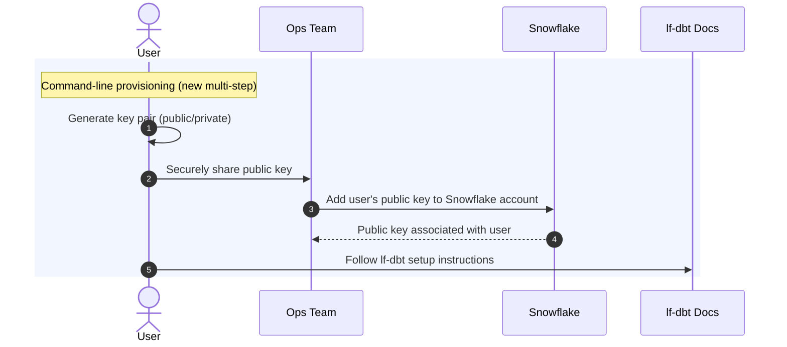

# Snowflake Setup Guide

## Overview

This guide provides instructions for setting up a Linux Foundation Snowflake account for web console and command line access.

## Account Setup

1. **Submit a support ticket** at the [IT Service Desk](https://jira.linuxfoundation.org/plugins/servlet/desk/portal/4/create/573)
   to request a new Snowflake account. Include the following information:

   - Your full name
   - Your role
   - Your LF staff or contractor email address
   - Whether you need command line access for building Snowflake/DBT models

2. **Account provisioning**: A Datalake or IT/Ops team member will create a pull request in the
  [LFX Snowflake terraform repository](https://github.com/linuxfoundation/lfx-snowflake-terraform), modifying the
  [users.tf file](https://github.com/linuxfoundation/lfx-snowflake-terraform/blob/main/users.tf).

3. **Account activation**: After the pull request is approved, merged, and deployed, your account will be active for
   console login.

4. **Command line setup** (if requested)
   1. The user needing command line access will need to generate a key pair to
     securely authenticate. Instructions for creating a key pair are outlined in
     the [Snowflake documentation](https://docs.snowflake.com/en/user-guide/key-pair-auth).
   2. Once generated, the user should share the _public_ key with the Ops team.
   3. The Ops team will add the _public_ key to the user's Snowflake account.
   4. Once the _public_ key is registered in Snowflake, the user should
     follow the setup instructions in the
     [lf-dbt repository](https://github.com/LF-Engineering/lf-dbt/?tab=readme-ov-file#important-files)
     to complete command line configuration.

Here is a diagram illustrating the process:

## Console Login

1. Navigate to the [Snowflake console](https://app.snowflake.com/jnmhvwd/xpb85243/) in your web browser.
2. Log in using your LF email address (e.g., [user@linuxfoundation.org](user@linuxfoundation.org)) via the SSO option.
3. After authentication, you will be redirected to the Snowflake landing page.

## Dashboard Access

View available dashboards in the [Projects → Dashboards](https://app.snowflake.com/jnmhvwd/xpb85243/dashboards) section
of the Snowflake console.

To request access to specific dashboards, contact the Datalake team in the #lfx-snowflake-dev Slack channel. The team will
review your request and adjust dashboard permissions as needed.

> Note: Users must first log in to the Snowflake console before they can be granted access to the dashboards.
